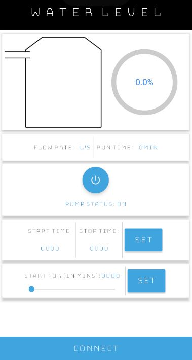
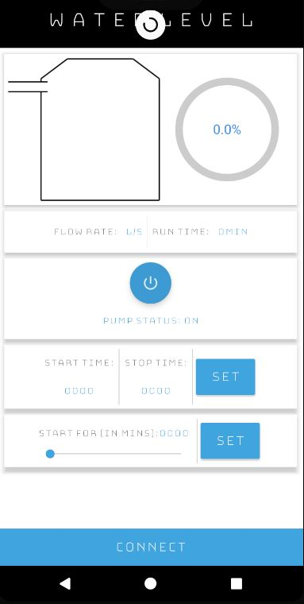
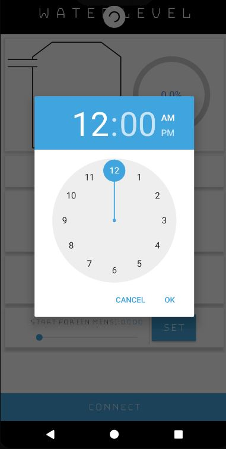
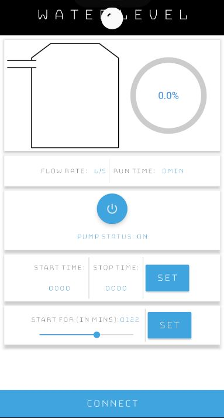

# Water-Level-Indicator
Android + Arduino project to get live status of the Water Tank!

## Features
1) Bluetooth connectivity
2) Animated status
3) Pull down to refresh
4) Rum for set Time duration 

## Screenshots
1) Main Menu

2) Pull Down to refresh

3) Set Time

4) Set Duration in Minutes

